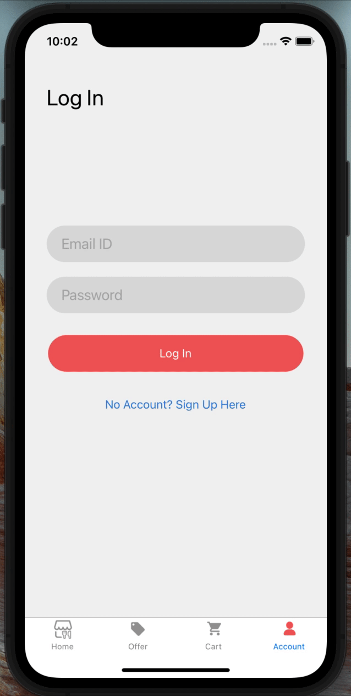
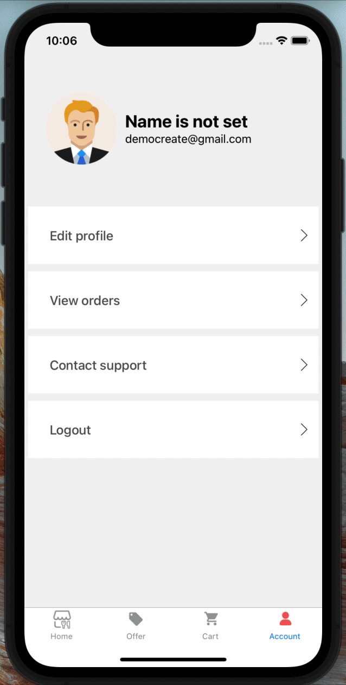
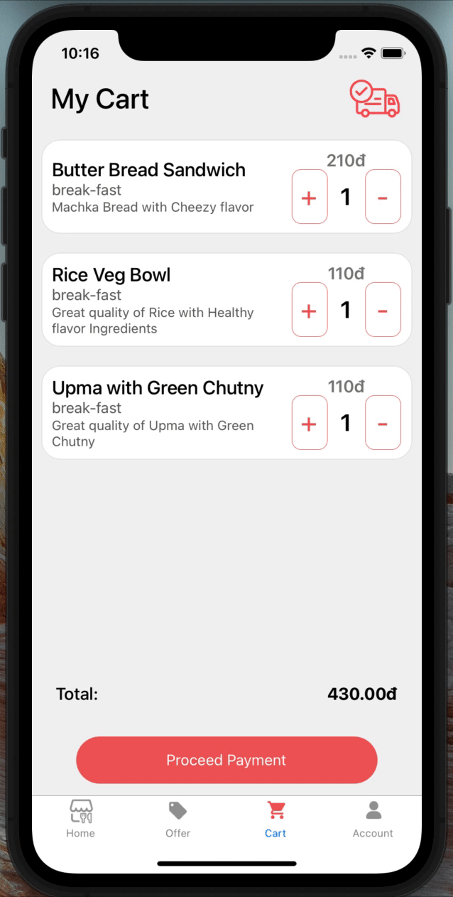

# Order Food App
Expo project

### Redux thunk

Redux Thunk [middleware](https://redux.js.org/advanced/middleware)
allows you to write action creators that return a function instead of an action.
The thunk can be used to delay the dispatch of an action, or to dispatch only if
a certain condition is met. The inner function receives the store methods
`dispatch` and `getState` as parameters.

```bash
npm install redux-thunk
```

Then, to enable Redux Thunk, use
[`applyMiddleware()`](https://redux.js.org/api/applymiddleware):

```js
import { createStore, applyMiddleware } from 'redux'
import thunk from 'redux-thunk'
import rootReducer from './reducers/index'

const store = createStore(rootReducer, applyMiddleware(thunk))
```

### The connect() function connects a React component to a Redux store
```javascript
function connect(mapStateToProps?, mapDispatchToProps?, mergeProps?, options?)
```

<br />

### Get Location & Home Screen


### Sign Up & Verify OTP


### Log Out & Log In


### Add to cart & Update cart


### Apply Promotion


### Proceed Payment & Create Order


### Order details & Cancel


### End of section.
